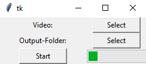

# Vid2JPG

This repository contains a Python script that converts a video file into a sequence of `.jpg` images. A simple Tkinter-based GUI allows users to select both the input video and the output folder.  

The script creates a new subfolder within the selected output directory, named according to the current date and time, where it stores the extracted images. If no output folder is selected, the script defaults to creating the output folder in the root directory (`C:\`).  

## Requirements  

Make sure you have the following libraries installed:  

- `tkinter` (for the GUI)  
- `opencv-python` (for video processing)  

## Supported Video Formats  

The script supports the following video formats:  

- `.mp4`  
- `.avi`  
- `.wmv`  

## Usage  

1. Run the script.  
2. Use the GUI to select a video file.  
3. Choose an output directory (optional).  
4. The script will extract frames and save them as `.jpg` images in a timestamped folder.  

Feel free to improve or modify the script as needed!  

