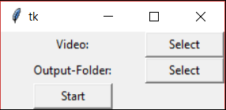

# Vid2JPG
This repository provides a python-script which converts a video-file to a folder of .jpg-images. Video and output-folder can be selected with a simple tk-GUI.
Inside the folder you select there will be created another folder with the name by date and time, which is filled with the output images.

Not selecting a output folder causes the script to create its output folder in the root-folder (C:\).

## Required libs:
- Tkinter
- OpenCV

### Supported Video-Formats:
- .mp4
- .avi
- .wmv

